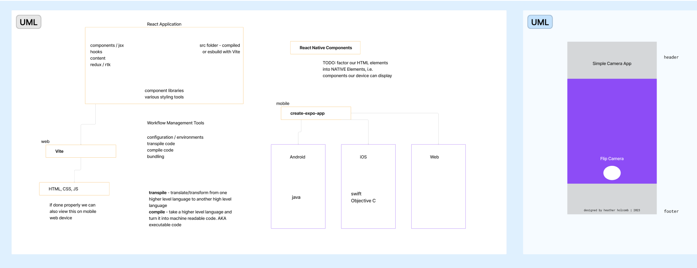

# LAB - Class 43

## Project: React Native

### Author: Heather Holcomb | 401d53

### Problem Domain  

Create your first native phone/device application using React Native, tapping into at least 2 phone features.

### Links and Resources

- [GitHub Actions ci/cd](https://github.com/holcombheather/js-401d53-class-43/actions)
<!-- - [back-end server url](http://xyz.com) (when applicable)
- [front-end application](http://xyz.com) (when applicable) -->

### Collaborators

- Lecture & demo with Ryan Gallaway
- Collaborating on test mobile app for final project with Nick Mullaney, Kati Lee, Francisco Sanchez

### Setup

#### `.env` requirements (where applicable)

- N/A

#### How to initialize/run your application (where applicable)

- `npm i`
- `npx expo prebuild`
- `npx expo run:ios`
- `npx expo start`

#### How to use your library (where applicable)

#### Features / Routes

- # Application Requirements

1. **Use 2 screens / components**
2. **Use and share state between components/screens**
3. **Use at least 1 native device feature (Contacts, Camera, GPS, etc)**
4. **Properly Documented for End Users**
5. **Live Demo & Presentation**

#### Tests

- How do you run tests?
- Any tests of note?
- Describe any tests that you did not complete, skipped, etc

#### UML

